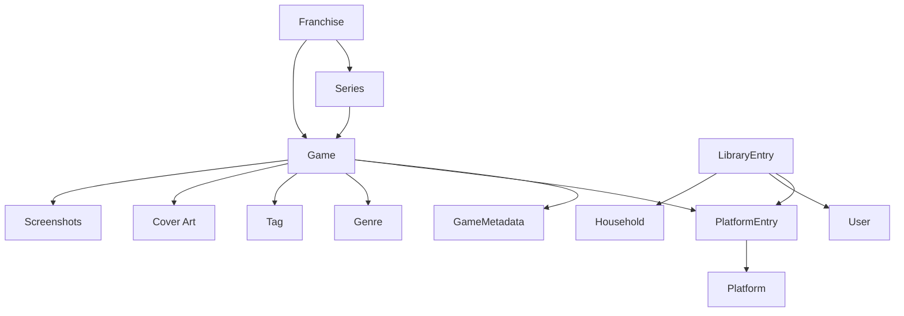

# Backlog Pilot

Backlog Pilot is an AI-native backlog curator for collectors with large libraries across Steam, Nintendo Switch, GBA, PSP, and PSVita. This first scaffold focuses on the product's core question:

> What should I play tonight?

The app is intentionally recommendation-first rather than spreadsheet-first. Collection management exists to support curation, not replace it.

## Local Setup

1. Install dependencies:

   ```bash
   npm install
   ```

2. (Optional) copy the example Prisma environment for local database work:

   ```bash
   cp .env.example .env
   ```

3. Start the app:

   ```bash
   npm run dev
   ```

4. Open [http://localhost:3000](http://localhost:3000).

## Validation Commands

- `npm run lint`
- `npm run typecheck`
- `npm run build`

## Architecture Notes

### Frontend

- Next.js App Router
- TypeScript
- Tailwind CSS v4
- Reusable card-based UI shell inspired by calm, opinionated productivity tools

### Domain Foundation

The canonical metadata scaffold includes typed models and demo data for:

- Users
- Households
- Platforms
- Canonical games
- Platform entries
- Game metadata
- Franchises
- Series
- Genres
- Tags
- Library entries (household/user ownership context)
- Recommendations
- Recommendation reasons
- Import sources
- Play statuses

#### Canonical model design

- `Game` is platform-agnostic and stores canonical identity (`canonicalTitle`, `normalizedTitle`, aliases, edition metadata, franchise/series links, media, genres, tags, release info).
- `PlatformEntry` stores platform-specific ownership records (`platform`, `platformGameId`, `ownershipType`, `acquiredDate`, `playtimeHours`, `completionStatus`) without duplicating the core `Game`.
- `GameMetadata` stores duplicate detection keys (alias + edition match fields) and enrichment data (external IDs, completion time, review score, popularity, genre/franchise weighting).



#### Required seed examples

`lib/demo-data.ts` includes canonical + platform entry examples for:

- Persona 4 Golden
- Yakuza 0
- Monster Hunter Rise
- Pokemon Emerald
- Final Fantasy Tactics: The War of the Lions

All MVP-first platforms are seeded in demo mode:

- Steam
- Nintendo Switch
- GBA
- PSP
- PSVita

### Persistence

Prisma is included with a starter schema in `prisma/schema.prisma`.

- The scaffold uses a local SQLite-style `DATABASE_URL` in `.env.example` for friction-free development.
- The schema is intentionally structured to stay portable so the app can be promoted to PostgreSQL later without rewriting the application layer.
- The UI currently reads from deterministic demo data in `lib/demo-data.ts`, which keeps the first-run experience working before real importers or auth exist.

### AI Service Abstractions

The following deterministic placeholder services are defined in `lib/ai/agents.ts`:

- `BacklogCoachAgent`
- `PurchaseAdvisorAgent`
- `RecommendationExplainer`
- `CollectionCuratorAgent`

They return stable, hard-coded responses based on the demo catalog so future issues can wire in real LLM calls without redesigning the interface.

### User Library Service

`lib/library/service.ts` provides the user library system of record with repository abstractions and API routes under `app/api/library`.

- Supports Steam, Nintendo Switch, GBA, PSP, and PSVita ownership records
- Stores canonical game references plus ownership/status/rating/notes/playtime metadata
- Integrates canonical game + metadata validation via the existing domain model (`lib/demo-data.ts` getters)

Endpoints:

- `GET /api/library?userId=:userId`
- `GET /api/library/games?userId=:userId[&status=:status][&platform=:platform][&q=:search]`
- `POST /api/library/games`
- `PATCH /api/library/games/:id?userId=:userId`
- `DELETE /api/library/games/:id?userId=:userId`
- `GET /api/library/stats?userId=:userId`

### Duplicate Ownership Detection Engine

`lib/duplicates` adds duplicate ownership detection across canonical games, remasters/definitive editions, and collection bundles.

- `DuplicateOwnershipService` identifies duplicate groups and exposes purchase/recommendation signals.
- `OwnershipGroupService` groups ownership records while preserving platform-specific records.
- `DuplicateAnalysisEngine` generates severity scoring and dashboard summary analytics.

Endpoints:

- `GET /api/duplicates?userId=:userId[&preferredPlatforms=platform-a,platform-b]`
- `GET /api/duplicates/groups?userId=:userId[&preferredPlatforms=platform-a,platform-b]`
- `GET /api/duplicates/summary?userId=:userId[&preferredPlatforms=platform-a,platform-b]`
- `GET /api/duplicates/:gameId?userId=:userId[&preferredPlatforms=platform-a,platform-b]`

### Steam Authentication and Account Linking

Steam account linking is implemented with OpenID-based identity verification and account management services under `lib/steam`.

- `SteamAuthProvider` creates OpenID login redirects and validates callback responses.
- `SteamIdentityService` fetches and normalizes Steam profile data (`steamId`, display name, avatar URL, profile URL).
- `SteamAccountService` links, reconnects, unlinks, and reports connected account status.

Routes:

- `GET /auth/steam?userId=:userId` — begin Steam OpenID flow
- `GET /auth/steam/callback` — validate OpenID callback and link account
- `GET /accounts/steam?userId=:userId` — connected account status
- `DELETE /accounts/steam?userId=:userId[&steamId=:steamId]` — unlink account

Security protections in the auth flow include:

- CSRF/state validation with one-time state records
- Session cookie validation (`steam_link_session`)
- OpenID response verification (`check_authentication`)
- Replay protection using tracked OpenID response nonces

UI support:

- `/settings` now includes a **Connected accounts** section with Steam status, avatar, profile link, and disconnect action.

### Steam Collection Synchronization

`lib/steam` now includes a complete Steam library ingestion pipeline that maps owned Steam titles into canonical Backlog Pilot library records.

- `SteamCollectionProvider` fetches and normalizes owned games (`appId`, title, playtime, last played, icon, logo).
- `SteamGameMatcher` applies deterministic matching priority:
  1. Steam app ID mapping
  2. exact title match
  3. alias match
  4. franchise + edition validation
- `SteamSyncService` runs idempotent initial and incremental sync, updates playtime metadata, tracks new and removed titles, and stores unmatched games.
- `SteamSyncJob` wraps manual and scheduled sync execution surfaces.

Routes:

- `POST /steam/sync` — run manual sync and return summary counters
- `GET /steam/sync/status?userId=:userId` — get latest sync status
- `GET /steam/library?userId=:userId` — list Steam-only library with most-played / recently-played / never-played groupings
- `POST /steam/sync/refresh` — user-triggered refresh sync

### Recommendation Scoring Engine

`lib/recommendations/scoring.ts` contains a deterministic, configurable recommendation scoring engine. It is independent of LLM services and produces explainable outputs with:

- `score` (0-100)
- `confidence` (0-100)
- ranked `reasons`
- per-factor `factors` breakdown

Current weighted factors:

- completion probability
- backlog age
- genre diversity
- platform preference
- session fit
- ownership duplication
- active rotation fit

Factor weights are configuration-driven via `RecommendationScoringEngine` constructor options, and `lib/recommendations/scoring.test.ts` covers deterministic behavior, explainability, weight overrides, and supported platform scoring.

### Play Tonight Experience

`lib/play-tonight` provides the recommendation-first “What should I play tonight?” flow by composing existing services instead of duplicating scoring logic.

- `PlayTonightService` consumes:
  - `RecommendationScoringEngine` (base score + reasons)
  - `FranchiseRecommendationSignals` (continuation and completion momentum)
  - `DuplicateOwnershipService` (duplicate ownership penalties)
- Session-aware filtering is exposed through built-in options:
  - 15 Minutes
  - 30 Minutes
  - 1 Hour
  - 2 Hours
  - 4+ Hours
- Platform preference filtering is supported through the `platform` query parameter.
- Recommendation payloads are intentionally capped at 4 cards (1 primary + up to 3 alternatives) to reduce decision fatigue.

Endpoints:

- `GET /api/play-tonight?userId=:userId[&session=:sessionOptionId][&platform=:platformId]`
- `GET /api/play-tonight/alternatives?userId=:userId[&session=:sessionOptionId][&platform=:platformId]`
- `GET /api/play-tonight/session-options`
- `POST /api/play-tonight/feedback`

Feedback actions:

- `play_this`
- `not_interested`
- `remind_me_later`
- `already_playing`
- `finished_it`

Analytics tracked:

- recommendation impressions
- recommendation acceptance
- recommendation rejection
- recommendation completion outcomes

### Recommendation API Service

`lib/recommendations` now exposes a dedicated API-facing recommendation layer built from:

- `RecommendationApiService` (request orchestration + scenario defaults)
- `RecommendationQueryService` (library/metadata/scoring/franchise + duplicate signals)
- `RecommendationResponseBuilder` (typed response contracts + explanation output)
- `RecommendationExplanationService` + `ExplanationTemplateEngine` + `ExplanationResponseBuilder` (deterministic explanation generation and structured UI-safe payloads)

Response contract includes:

- primary recommendation + alternatives
- score + confidence
- reasons + factor breakdown
- structured explanation reasons for future AI enrichment
- estimated completion hours
- deterministic ranking output with pagination metadata

Endpoints:

- `GET /api/recommendations?userId=:userId[&type=:type][&platform=:platform][&genre=:genre][&franchise=:franchiseId][&status=:statusCsv][&ownershipType=:ownershipType][&minEstimatedHours=:hours][&maxEstimatedHours=:hours][&targetSessionMinutes=:minutes][&page=:page][&pageSize=:pageSize]`
- `POST /api/recommendations/query`
- `GET /api/recommendations/play-tonight?userId=:userId`
- `GET /api/recommendations/franchise?userId=:userId[&franchise=:franchiseId]`
- `GET /api/recommendations/backlog?userId=:userId`
- `GET /api/recommendations/short-session?userId=:userId`
- `GET /api/recommendations/long-session?userId=:userId`

Supported request types:

- `play-tonight`
- `continue-franchise`
- `short-session`
- `long-session`
- `backlog-reduction`
- `custom`

### Franchise Completion Tracking Engine

`lib/franchises` adds franchise and series-aware completion tracking on top of the canonical catalog and user library services.

- `FranchiseTrackingService` groups owned canonicals into franchise and series buckets using the canonical `Game.franchiseId` and `Game.seriesId` links from metadata enrichment.
- `FranchiseProgressService` calculates owned completion metrics, near-completion views, dashboard summaries, and campaign-ready progress snapshots.
- `SeriesProgressService` exposes per-series completion progress inside each franchise.
- `FranchiseRecommendationSignals` generates recommendation inputs for:
  - `nearFranchiseCompletionBonus`
  - `abandonedFranchisePenalty`
  - `franchiseAffinityScore`
  - `seriesContinuationBonus`

Endpoints:

- `GET /api/franchises/progress?userId=:userId`
- `GET /api/franchises/:id/progress?userId=:userId`
- `GET /api/franchises/:id/recommendations?userId=:userId`
- `GET /api/franchises/near-completion?userId=:userId`

Completion rules:

- Progress is calculated as `completedOwnedGames / totalOwnedGames`.
- Archived library entries are excluded by default.
- Dashboard summaries expose closest franchises to completion, largest unfinished franchises, most completed franchises, abandoned runs, and active campaign suggestions.

Recommendation integration:

- Franchise signals are generated separately from the base recommendation score so callers can layer them into ranking without rewriting `RecommendationScoringEngine`.
- This makes franchise-aware strategies straightforward for Backlog Coach, Completion Campaigns, Purchase Advisor, and Collection Dashboard flows.

### Metadata Enrichment Pipeline (IGDB)

`lib/metadata` adds an IGDB-first canonical enrichment pipeline with provider abstractions and refresh workflows:

- `IGDBProvider` defines the real IGDB API integration surface (`searchByTitle`, `searchByAlias`, `searchByExternalIds`, `getGameDetails`, `getFranchise`, `getPlatformMappings`).
- `InMemoryIGDBProvider` provides deterministic fixture data for tests and local development.
- `MetadataEnrichmentService` implements `enrichGame`, `bulkEnrich`, `refreshGame`, and `refreshAll`.
- `MetadataRefreshService` provides a dedicated refresh workflow wrapper for scheduled/manual refresh jobs.
- Deterministic matching priority is implemented as:
  1. exact title
  2. alias
  3. franchise + title similarity
  4. release date validation

The normalization pipeline enriches canonical `Game` + `GameMetadata` records with:

- aliases and alias match keys
- franchise and series links
- genres, themes/keywords (as tags)
- release date
- developers and publishers
- cover art and screenshot URLs (reference-only; no asset downloads)
- supported platform mappings (Steam, Nintendo Switch, GBA, PSP, PSVita)

Caching behavior:

- Avoids repeated provider calls within a configurable TTL.
- Tracks refresh timestamps in cache records.
- Supports forced refresh (`forceRefresh: true`) for workflow reruns.

## App Routes

- `/` — landing / welcome
- `/onboarding` — first-run onboarding and import source selection
- `/dashboard` — recommendation-first home
- `/library` — collection browser placeholder
- `/queue` — active rotation / backlog queue placeholder
- `/recommendations` — AI recommendation surface
- `/settings` — household, persistence, and future integrations placeholder
